#  Sonnet Shamba


> Repository: local-farmers-system

A comprehensive digital platform connecting Kenyan smallholder farmers with buyers, agricultural experts, and essential market information.

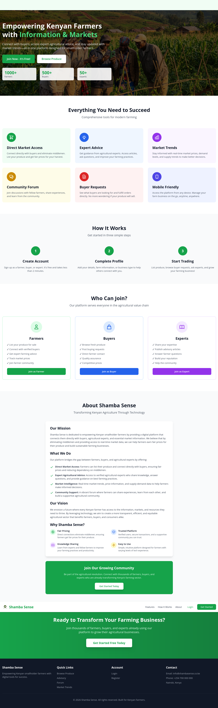

##  Table of Contents
- [About](#about)
- [Features](#features)
- [Tech Stack](#tech-stack)
- [Screenshots](#screenshots)
- [Installation](#installation)
- [Usage](#usage)
- [Project Structure](#project-structure)

##  About

Sonnet Shamba empowers Kenyan farmers by:
- Connecting them directly with buyers (eliminating middlemen)
- Providing access to agricultural experts
- Offering real-time market trends and pricing data
- Building a supportive farming community through forums

##  Features

### For Farmers 
-  List produce for sale with images
-  View buyer requests and fulfill orders
-  Access expert agricultural advice
-  Track market prices and trends
-  Participate in community discussions

### For Buyers 
-  Browse fresh produce from local farmers
-  Post buying requests
-  Direct contact with farmers
-  Access to quality produce at fair prices

### For Experts 
-  Publish advisory articles
-  Answer farmer questions in the forum
-  Share best farming practices
-  Build reputation in the community

### For Admins 
-  User management and analytics
-  Content moderation (forum, produce, requests)
-  Platform statistics and charts
-  Market trend data management

##  Tech Stack

### Frontend
- **React** - UI framework
- **React Router** - Navigation
- **Tailwind CSS** - Styling
- **Chart.js** - Data visualization
- **Axios** - HTTP client

### Backend
- **Node.js** - Runtime environment
- **Express.js** - Web framework
- **MySQL** - Database
- **JWT** - Authentication
- **bcryptjs** - Password hashing
- **Multer** - File uploads

##  Screenshots

### Landing Page

*Hero section with Sonnet Shamba branding and features overview*

### Authentication
<p>
  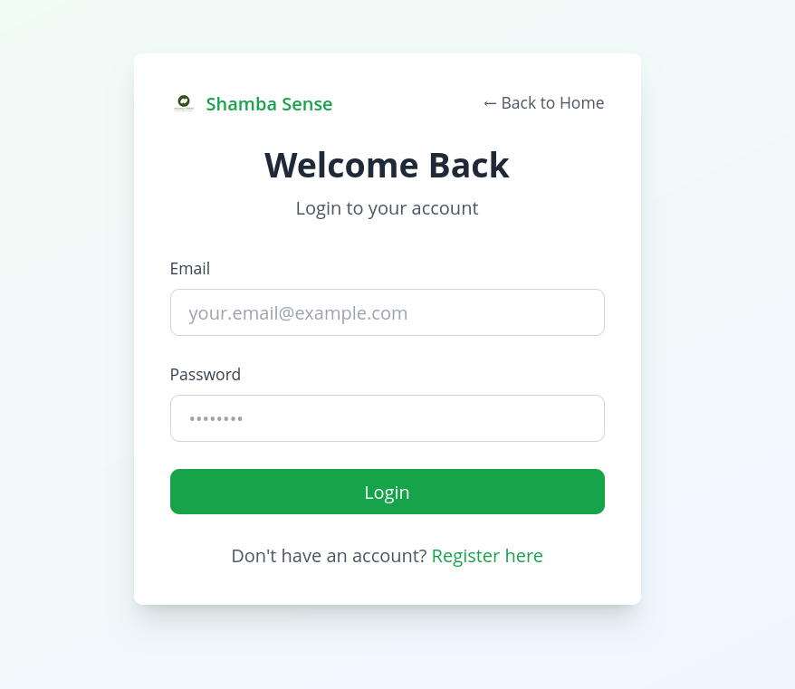
  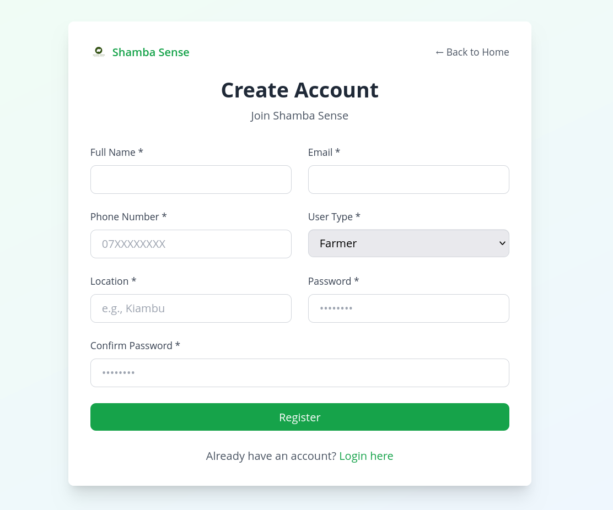
</p>
*Login and registration pages with Sonnet Shamba branding*

### Farmer Dashboard
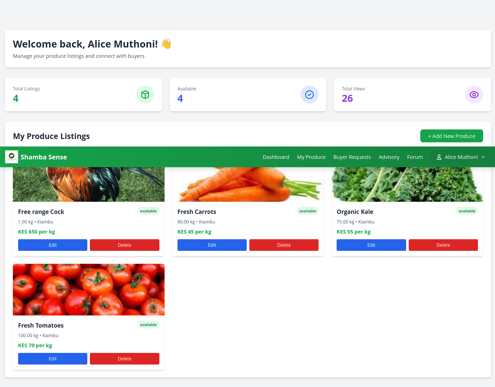
*Farmer's main dashboard with statistics and quick actions*

### My Produce
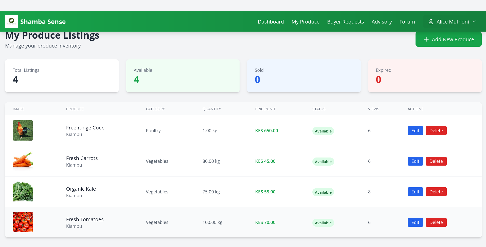
*Farmers can manage their produce listings with full CRUD operations*

### Buyer Requests
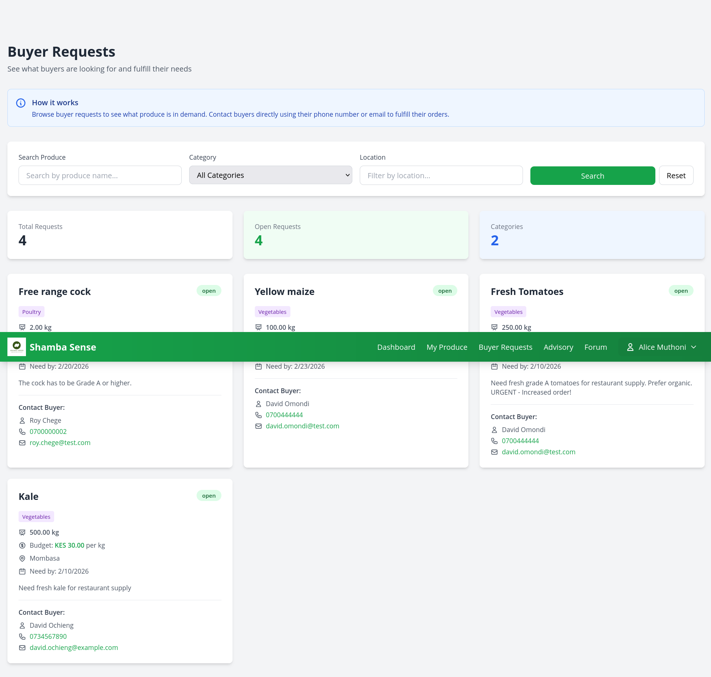
*View what buyers are looking for and contact them directly*

### Browse Produce
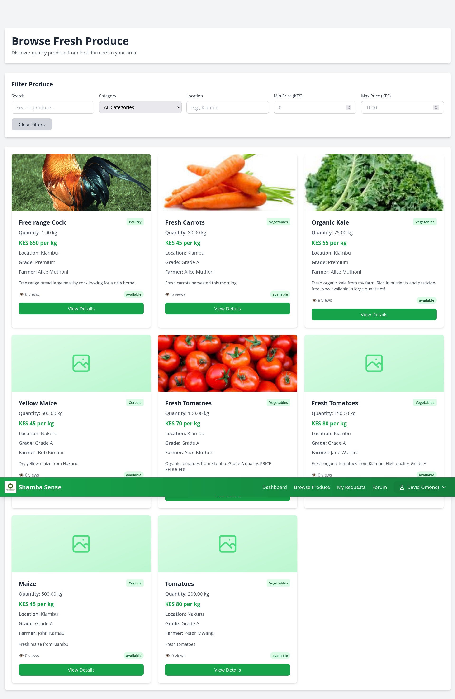
*Marketplace for buyers to browse and filter fresh produce*

### Buyer Dashboard
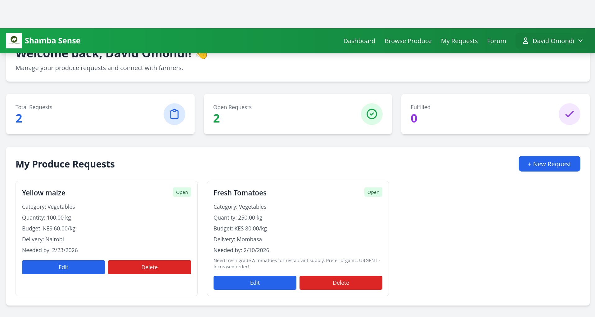
*Buyer's main dashboard with their requests and activity*

### My Requests
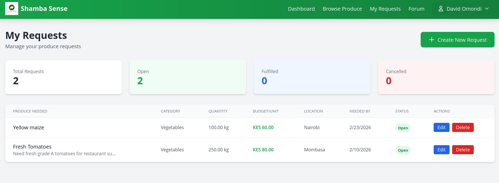
*Buyers can manage their produce requests*

### Expert Dashboard

*Agricultural expert's dashboard*

### My Advisory
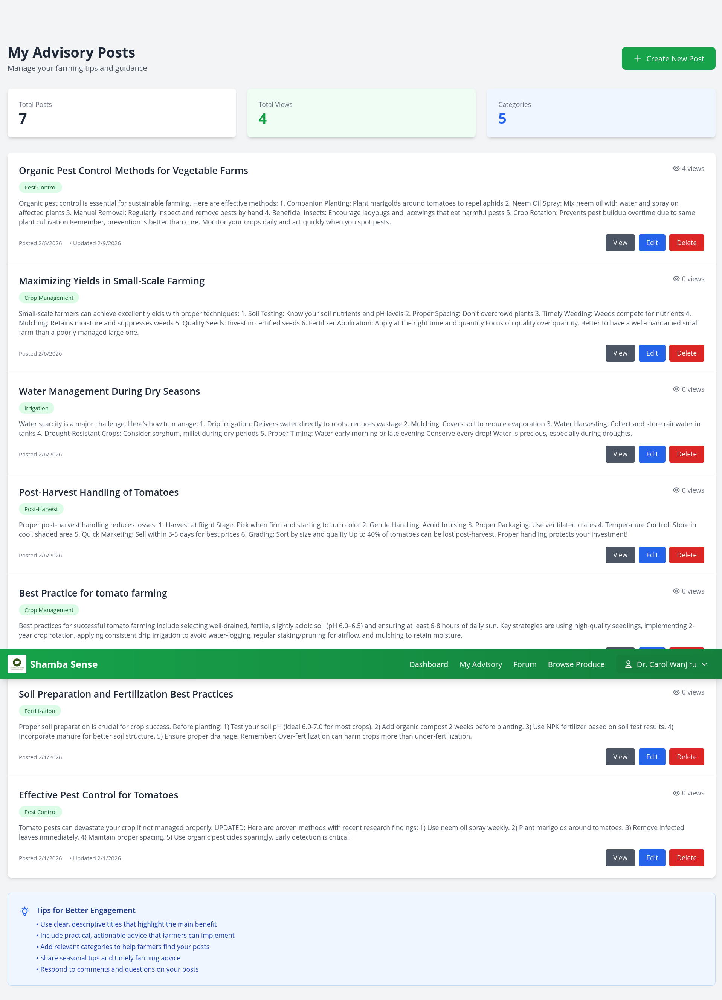
*Experts can manage their advisory posts and articles*

### Forum
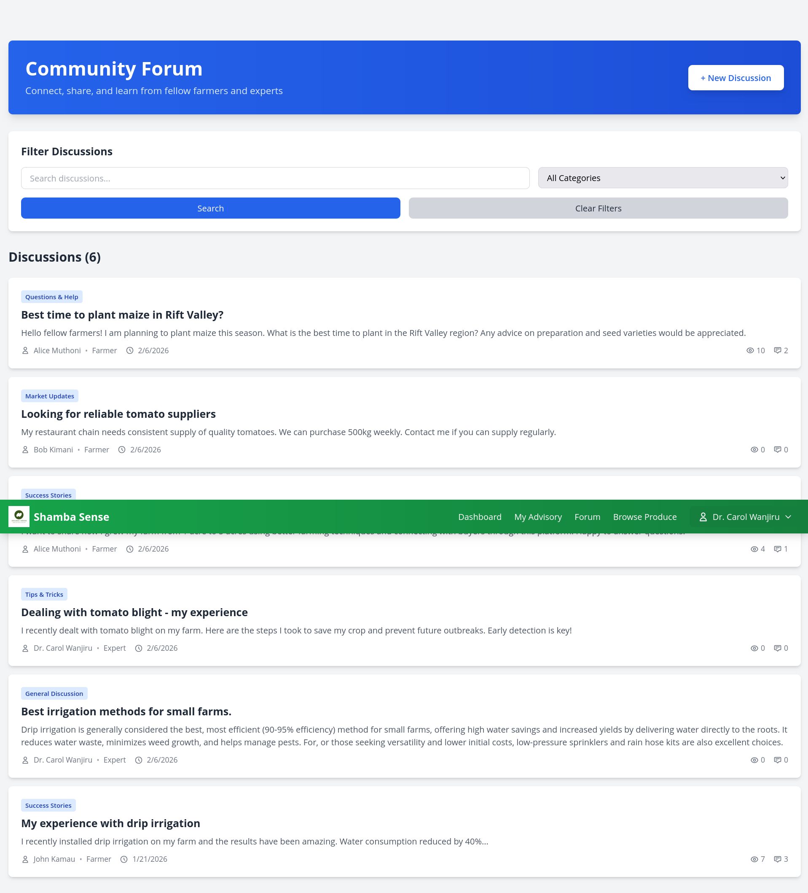
*Community discussion platform for farmers, buyers, and experts*

### Market Trends
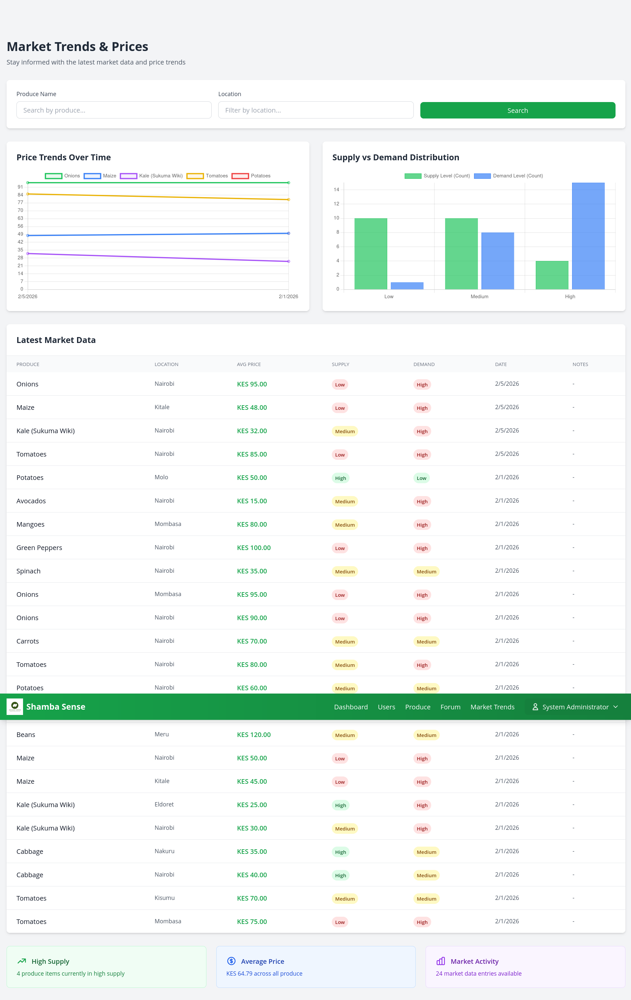
*Real-time market data with interactive charts showing price trends and supply/demand*

### Admin Dashboard
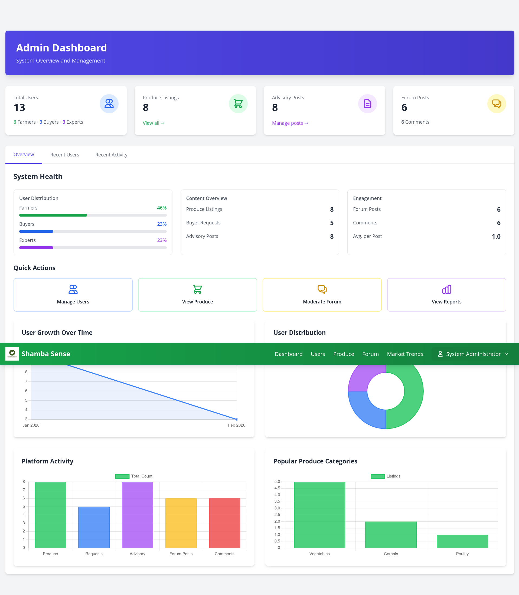
*Admin analytics dashboard with comprehensive platform statistics*

### Manage Users
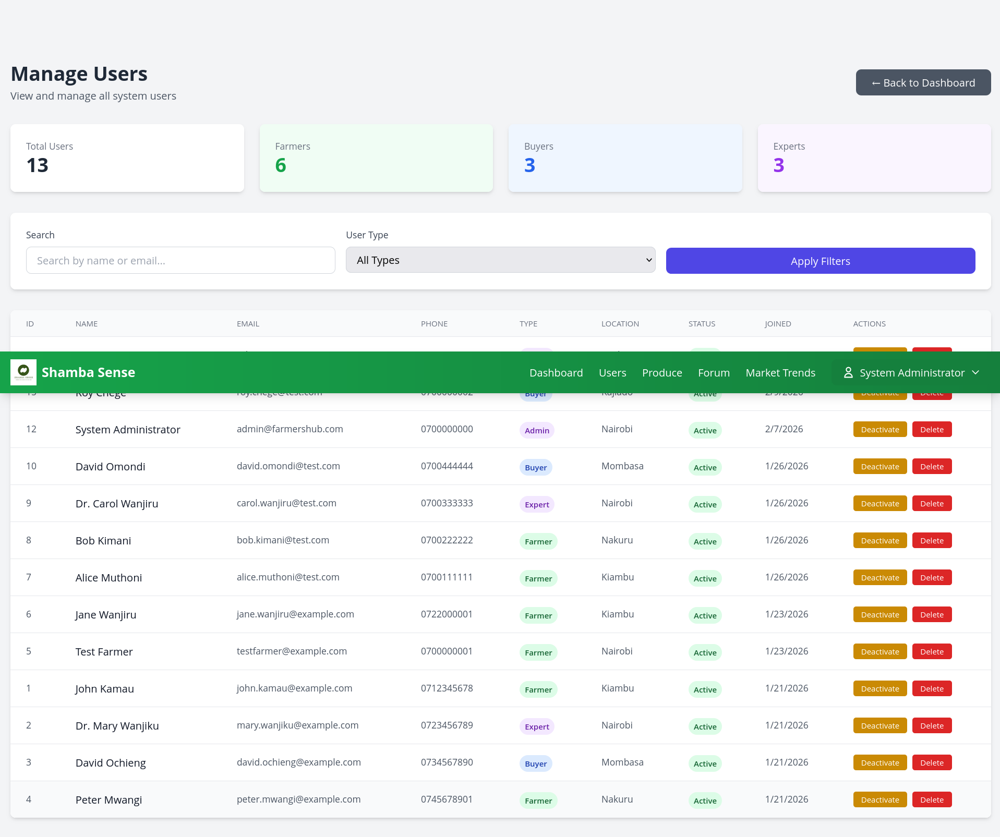
*Admin user management interface*

##  Installation

### Prerequisites
- Node.js (v14 or higher)
- MySQL (v8 or higher)
- npm or yarn

### Backend Setup

1. Clone the repository
```bash
git clone https://github.com/PeterMwaniki-dev/local-farmers-system.git
cd local-farmers-system
```

2. Install backend dependencies
```bash
cd server
npm install
```

3. Create database
```bash
mysql -u root -p
CREATE DATABASE local_farmers_db;
```

4. Import database schema
```bash
mysql -u root -p local_farmers_db < database/schema.sql
```

5. Create `.env` file in server directory
```env
PORT=5000
DB_HOST=localhost
DB_USER=root
DB_PASSWORD=yourpassword
DB_NAME=local_farmers_db
JWT_SECRET=your_jwt_secret_key_here
```

6. Start backend server
```bash
npm start
```

### Frontend Setup

1. Install frontend dependencies
```bash
cd Frontend
npm install
```

2. Start development server
```bash
npm run dev
```

3. Open browser to `http://localhost:5173`

##  Usage

### Test Accounts
The system comes with pre-configured test accounts:

**Farmer:**
- Email: alice.muthoni@test.com
- Password: alice123

**Buyer:**
- Email: david.omondi@test.com
- Password: password123

**Expert:**
- Email: carol.wanjiru@test.com
- Password: password123

**Admin:**
- Email: admin@farmershub.com
- Password: admin123

##  Project Structure
```
sonnet-shamba/
├── Frontend/                # React frontend
│   ├── public/             # Static assets
│   │   └── Images/         # Logo and images
│   ├── src/
│   │   ├── components/     # Reusable components
│   │   ├── contexts/       # React contexts (Auth)
│   │   ├── pages/          # Page components
│   │   └── services/       # API service files
│   └── package.json
│
├── server/                 # Express backend
│   ├── config/            # Database configuration
│   ├── controllers/       # Route controllers
│   ├── middleware/        # Custom middleware (auth, upload)
│   ├── routes/            # API routes
│   ├── uploads/           # User uploaded files
│   └── server.js          # Entry point
│
├── database/              # SQL schema and seed data
├── screenshots/           # Application screenshots
└── README.md
```

##  Key Features Implemented

-  Role-based authentication (Farmer, Buyer, Expert, Admin)
-  Image upload for produce listings
-  Real-time market trends with interactive charts
-  Community forum with comments
-  Expert advisory system
-  Buyer request marketplace
-  Admin analytics dashboard
-  Responsive design (mobile-friendly)
-  Secure JWT authentication
-  Password hashing with bcrypt
-  File upload with Multer

##  Contributing

This is a student project, but contributions are welcome! Please feel free to submit a Pull Request.

##  License

This project is licensed under the MIT License.

##  Author

**Peter Mwaniki**
- GitHub: [@PeterMwaniki-dev](https://github.com/PeterMwaniki-dev)

##  Acknowledgments

- Built to empower Kenyan smallholder farmers
- Inspired by the need to connect farmers directly with markets
- Developed using modern web technologies

---

 If you found this project helpful, please give it a star!
